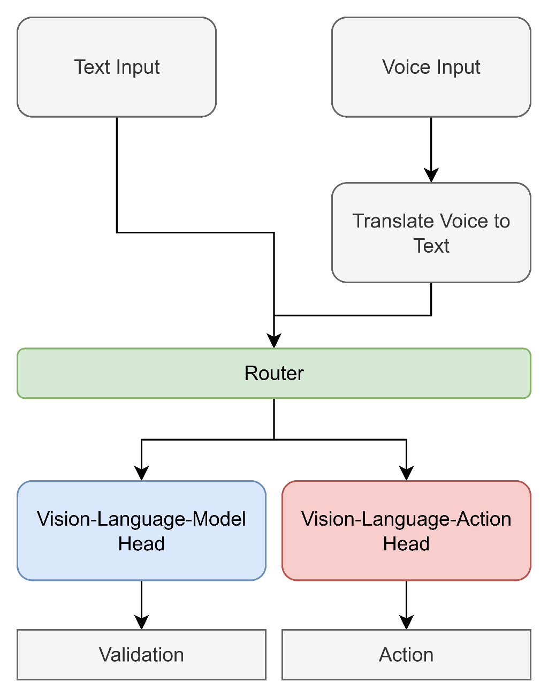

***

# Command-Driven Single-Robot System for Object Detection and Task Execution

[](https://www.python.org/)
[](https://pytorch.org/)
[]()

## 📖 Overview

This project presents a novel **"Dual-Head" architecture** for domestic robotic assistance. Instead of relying on a single monolithic AI model, this system intelligently routes user commands to specialized components:
1.  **VLM Head (Vision-Language Model):** For scene understanding and conversational queries.
2.  **VLA Head (Vision-Language-Action Model):** For executing physical robotic tasks.

The system is designed to be **computationally efficient**, **offline-capable**, and modular, running entirely on consumer-grade hardware.

## 🏗️ System Architecture

The workflow operates as an intelligent pipeline:

1.  **Input:** Voice (transcribed via **Whisper**) or Text.
2.  **Command Router:** A fine-tuned **6-layer BERT** model classifies the intent:
    *   *Query:* "Where are my keys?" $\rightarrow$ Sent to VLM.
    *   *Action:* "Put the cube in the tray." $\rightarrow$ Sent to VLA.
3.  **Execution Heads:**
    *   **VLM:** Powered by **Gemma 3n E2B** (utilizing PLE caching for efficiency).
    *   **VLA:** Powered by **SpatialVLA** (fine-tuned with LoRA on a custom PyBullet dataset).

<p align="center">
  
</p>

## 🚀 Key Features

*   **Modular Design:** Decouples reasoning from action, allowing independent upgrades of the VLM or VLA components.
*   **Offline Privacy:** All models run locally without cloud dependencies.
*   **Voice Integration:** Native speech-to-text support using OpenAI's Whisper.
*   **Resource Efficiency:** Optimized to run on <16GB VRAM (utilizing quantization and layer pruning).
*   **Simulation Environment:** Custom PyBullet environment for robotic arm manipulation (Franka Emika Panda).

## 🛠️ Installation

### Prerequisites
*   Windows 11 or Linux
*   Python 3.8+
*   GPU with at least 8GB VRAM (Recommended: 12GB+)
*   CUDA Toolkit installed

### Setup
1.  **Clone the repository:**
    ```bash
    git clone https://github.com/ahrzeroday/Command-Driven-Single-Robot-System-for-Object-Detection-and-Task-Execution.git
    cd Command-Driven-Single-Robot-System-for-Object-Detection-and-Task-Execution
    ```

2.  **Create a virtual environment:**
    ```bash
    python -m venv venv
    source venv/bin/activate  # On Windows use: venv\Scripts\activate
    ```

    *(Note: Ensure you have `torch`, `transformers`, `peft`, `pybullet`, `bitsandbytes`, and `openai-whisper` installed).*

## 📊 Results & Performance

All experiments were conducted on an **ASUS ROG Zephyrus G15 (Ryzen 9, RTX 3070 Ti 8GB)**.

### Component Performance
| Component | Model | Metric | Result |
|-----------|-------|--------|--------|
| **Command Router** | BERT (6-layer, Pruned) | Classification Accuracy | **93.38%** |
| **VLM Head** | Gemma 3n E2B | Query Accuracy (Real-World) | **~80.96%** |
| **VLA Head** | SpatialVLA (Fine-tuned) | Task Logic Learning | 4% |

### Key Findings
*   **Efficiency:** The router was successfully pruned to 6 layers without accuracy loss, significantly reducing latency.
*   **The "What" vs. "How" Dilemma:** The VLA model successfully learned the *semantic sequence* of tasks (reaching, moving to target) but struggled with the *fine-motor skills* (grasping), achieving a 4% full task completion rate. This highlights the need for specialized "grasping expert" policies in future work.

## 📝 Citation

If you use this work or concepts in your research, please cite the dissertation:

```bibtex
@mastersthesis{RahimiBidrouni2025,
  author  = {AmirHossein Rahimi Bidrouni},
  title   = {Command-Driven Single-Robot System for Object Detection and Task Execution},
  school  = {Aston University},
  year    = {2025},
  month   = {December},
  type    = {MSc Dissertation}
}
```

***
*For more details, please refer to the PDF documentation included in this repository.*
